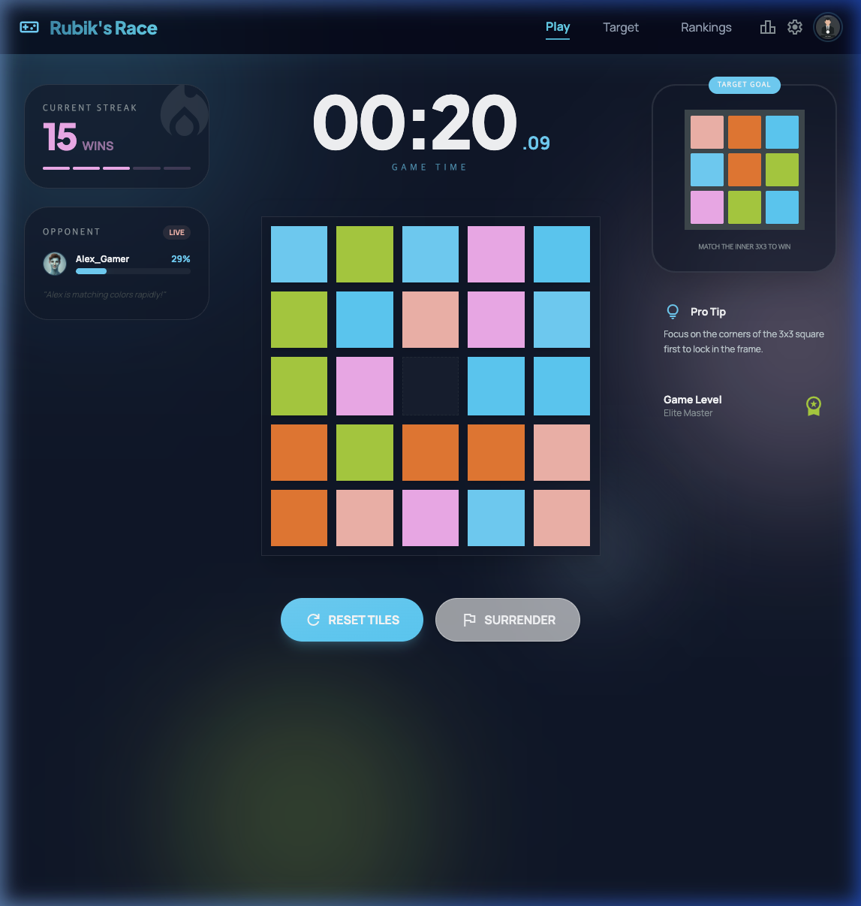
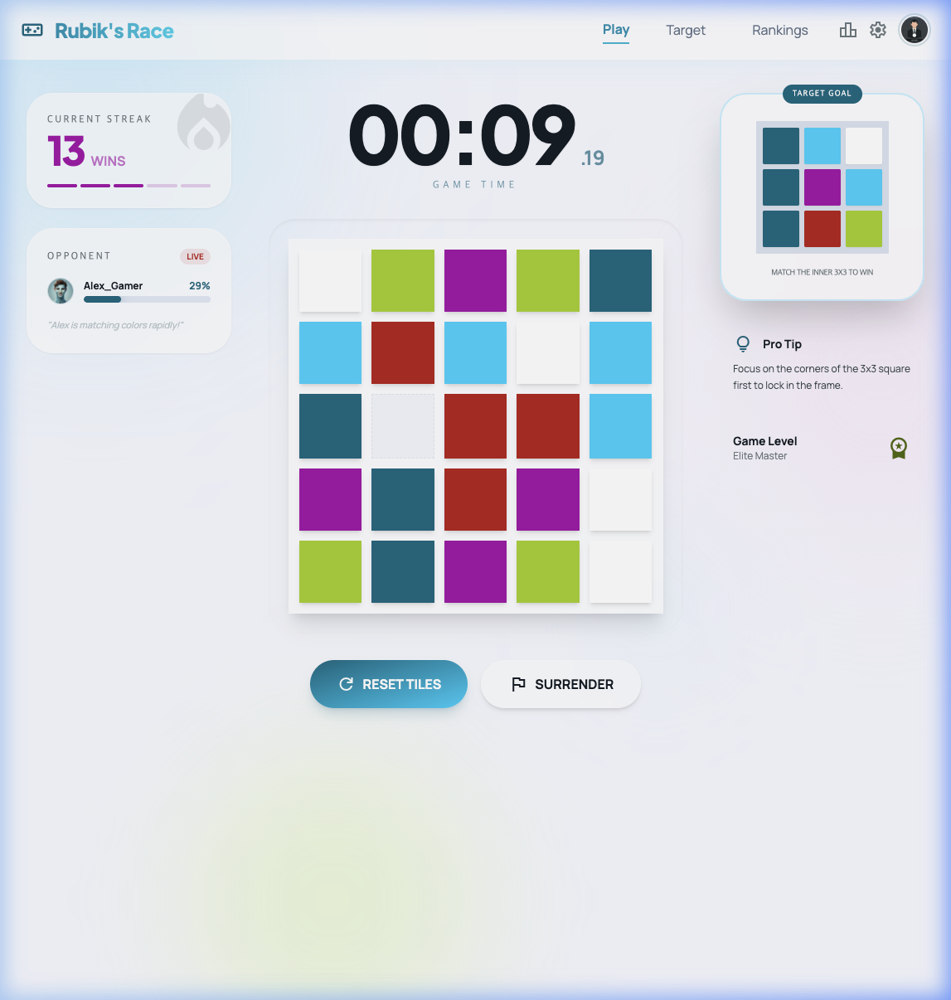

# Rubik's Race 🧩

A fast-paced sliding puzzle game inspired by the classic Rubik's Race. Match the center 3x3 pattern with the target goal to win!

## ✨ Features
- **Dark Mode Support**: Sleek and modern design that looks great in any lighting.
- **Dynamic Gameplay**: Randomized board and target patterns every time.
- **Simulated Opponent**: Real-time progress tracking of an AI opponent to keep the pressure on!
- **Timer & Tracking**: High-precision timer and win streak counter to monitor your performance.
- **Glassmorphism UI**: Beautiful, premium interface with smooth animations.

## 📸 Screenshots

### 🌓 Dark Mode (Current Theme)


### ☀️ Light Mode


## 🎮 How to Play
1.  **Objective**: Match the **center 3x3 square** of your 5x5 board with the **Target Goal** shown on the right.
2.  **Movement**: Click on any tile adjacent to the empty slot to slide it.
3.  **Strategy**: Focus on the edges and corners of the 3x3 square first to lock in the frame.
4.  **Win**: Once the patterns match perfectly, you'll be greeted with a victory!

## 🚀 Getting Started

### Prerequisites
- [Node.js](https://nodejs.org/) (v16.x or higher recommended)
- [npm](https://www.npmjs.com/)

### Installation
1.  **Clone the repository**:
    ```bash
    git clone https://github.com/xjustice/rubiks-race.git
    cd rubiks-race
    ```
2.  **Install dependencies**:
    ```bash
    npm install
    ```
3.  **Run locally**:
    ```bash
    npm run dev
    ```
    Open `http://localhost:5173/` in your browser.

## 🛠️ Built With
- **HTML5/Tailwind CSS**: Modern UI and styling.
- **JavaScript**: Core game logic.
- **Vite**: Ultra-fast build tool for local development.

## 📝 License
This project is open-source and available under the [ISC License](LICENSE).
